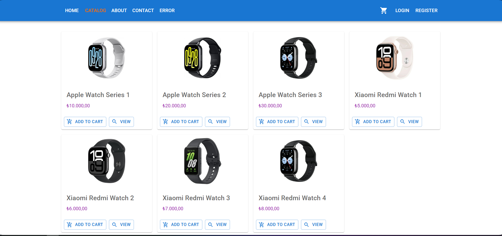
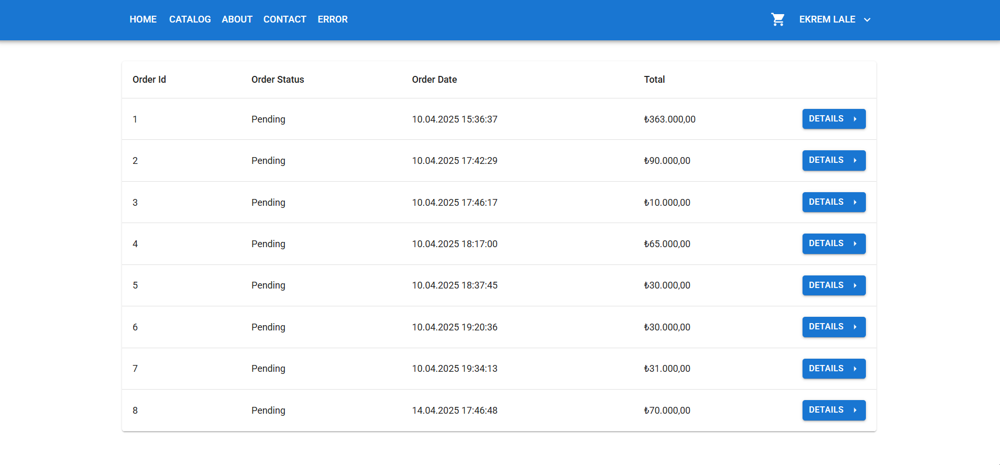
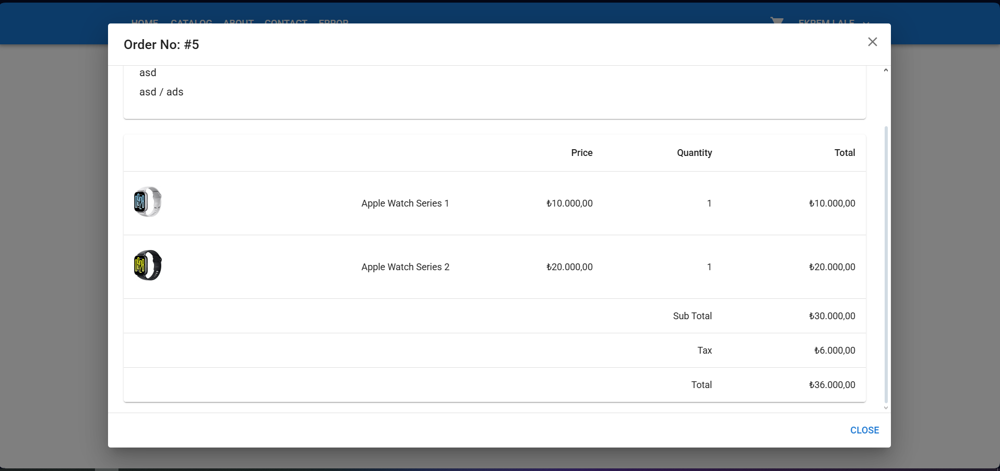
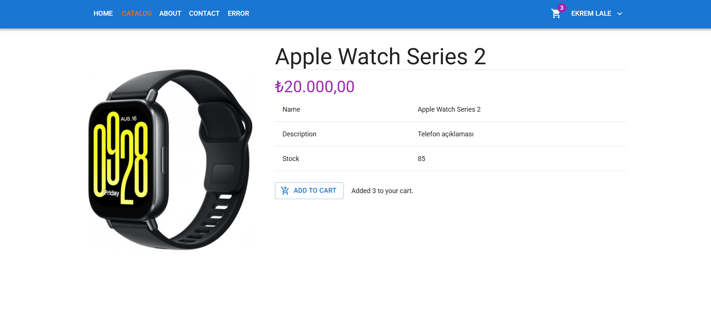
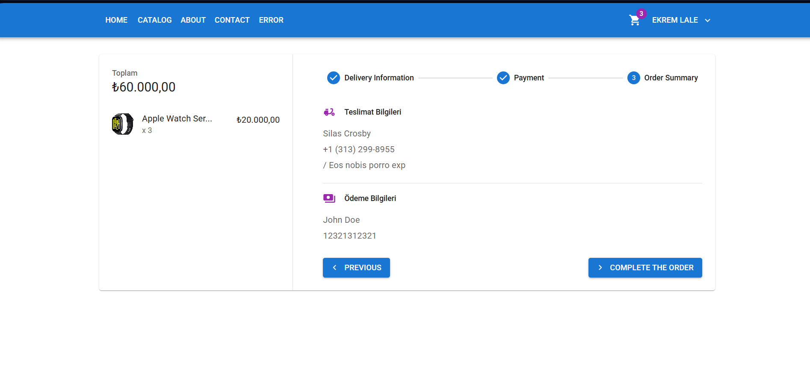

#🛒 dotnetShop
dotnetShop is a full-stack e-commerce project featuring a robust ASP.NET Core backend with JWT authentication and a responsive React frontend. It follows clean architecture principles and a modern API-first design to deliver a scalable and maintainable solution.

Throughout the project, I actively reinforced my knowledge of ASP.NET Core's key features, such as dependency injection, middleware configuration, and controller-service separation — making this project not just a build, but a hands-on learning experience as well.

In addition to standard e-commerce functionality, this application includes Iyzico payment integration, enabling secure and localized online transactions. This adds a real-world aspect to the project and simulates how professional systems interact with third-party payment providers.

While the current version of dotnetShop is a simple-scale implementation, it provides a solid foundation for further development. Future improvements may include features such as order tracking, customer support chat, discount systems, and advanced analytics.


## 🚀 Features

- 🔐 JWT-based user authentication and role-based authorization  
- 🍭 Product listing, filtering by category, and detailed views  
- 🛒 Cart operations (add/remove/update products)  
- 💳 Order creation and simulated checkout process  
- 🛠️ Admin panel for product and inventory management  
- 📡 RESTful API structure with clean controller/service architecture  
- 🧹 React frontend with component-based structure  
- 🌐 CORS-enabled for frontend-backend communication  
- 🪪 API documentation via Swagger

## 🛠️ Technologies Used

### Backend
- **.NET 9 / ASP.NET Core**
- **Entity Framework Core**
- **AutoMapper**
- **SQL Server**
- **JWT Authentication**
- **Swagger (Swashbuckle)**

### Frontend
- **React**
- **Axios**
- **React Router**
- **Tailwind CSS** *(if applicable)*

### Tools & Others
- **Postman** – API testing  
- **Visual Studio / VS Code**  
- **Git & GitHub**

## 📸 Screenshots







## ⚙️ Getting Started

### Prerequisites

- [.NET 9 SDK](https://dotnet.microsoft.com/en-us/download)
- [Node.js & npm](https://nodejs.org/)
- [SQL Server or Azure Data Studio](https://learn.microsoft.com/en-us/sql/azure-data-studio/)
- [Visual Studio 2022+ / VS Code](https://code.visualstudio.com/)
- (Optional) Postman

---

## 🔧 Backend Setup

1. Clone the repository:
```bash
git clone https://github.com/EkremL/dotnetShop.git
cd dotnetShop
```

2. Create a new `appsettings.json` file in the root folder:
```json
{
  "ConnectionStrings": {
    "DefaultConnection": "Server=.;Database=dotnetShopDb;Trusted_Connection=True;"
  },
  "JWT": {
    "Key": "EnterASecureKeyHere",
    "Issuer": "dotnetShopAPI"
  }
}
```

3. Apply migrations & update the database:
```bash
dotnet ef database update
```

4. Run the backend:
```bash
dotnet run
```

5. Access Swagger at:  
[http://localhost:5000/swagger/index.html](http://localhost:5000/swagger/index.html)


## 💻 Frontend Setup

If the frontend is inside a `/client` folder:

```bash
cd client
npm install
npm run dev
```

> Make sure the backend is running and CORS is enabled.


## 📁 Project Structure (Simplified)
```
dotnetShop/
├── client/                  # React frontend
│   ├── src/
│   ├── public/
│   └── ...
├── API/                     # ASP.NET Core backend
│   ├── Controllers/
│   ├── Data/
│   ├── DTOs/
│   ├── Entity/
│   ├── Services/
│   └── Program.cs
```
## ✍️ Developer

**Ekrem Can Lale**

## 🤝 Contributing

Feel free to fork the repo, open issues, or submit pull requests. All kinds of contributions are welcome!

## 📄 License

This project is open-source and available under the [MIT License](LICENSE).

